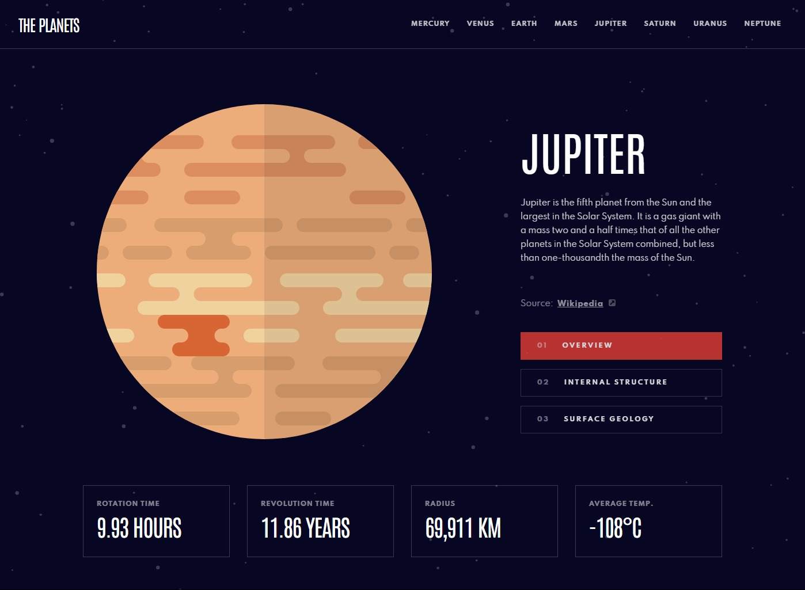
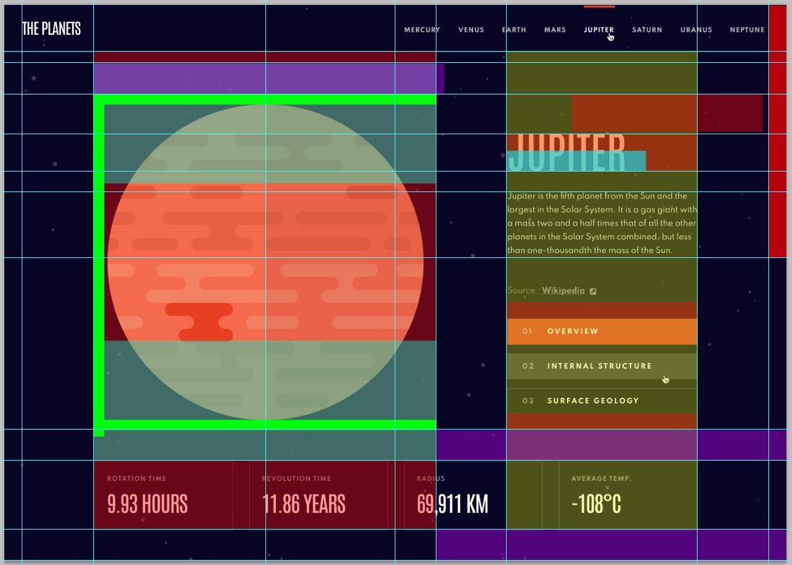
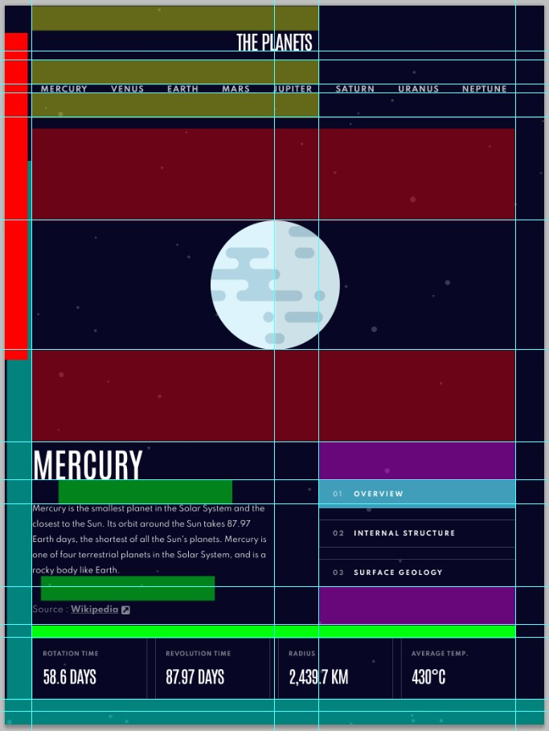
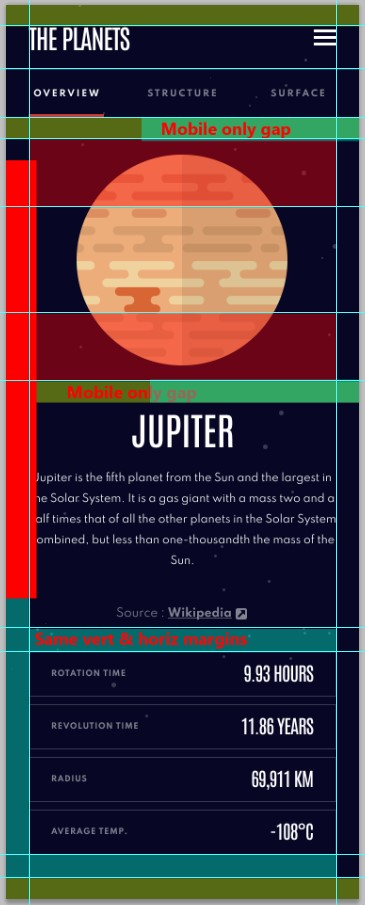

# Frontend Mentor - Planets fact site solution

A solution by jefflangtech [Planets fact site challenge on Frontend Mentor](https://www.frontendmentor.io/challenges/planets-fact-site-gazqN8w_f). 

## Table of contents

- [Overview](#overview)
  - [The challenge](#the-challenge)
  - [Screenshot](#screenshot)
  - [Links](#links)
- [My process](#my-process)
  - [Built with](#built-with)
  - [Step by step](#step-by-step)
  - [Continued development](#continued-development)
  - [Useful resources](#useful-resources)
- [Author](#author)

## Overview

### The challenge

Users should be able to:

- View the optimal layout for the app depending on their device's screen size
- See hover states for all interactive elements on the page
- View each planet page and toggle between "Overview", "Internal Structure", and "Surface Geology"

### Screenshot

### Links

- Solution URL: [Add solution URL here](https://your-solution-url.com)
- Live Site URL: [https://jefflangtech.github.io/planet-facts/](https://jefflangtech.github.io/planet-facts/)

## My process

### Built with

- Semantic HTML5 markup
- CSS custom properties
- Flexbox
- Grid
- DOM API: DocumentFragment

### Step by step

1. Initial setup (19:15)
2. Project plan (1:13)
3. Layout notes (3:03)
4. Setup design system (1:46)
5. HTML structure and preliminary validation tests (0:40)
6. Style desktop layout & secondary validation tests (2:56)
7. Style tablet layout (1:26)
8. Style mobile layout & basic drawer functionality (2:40)
9. Update readme for design notes (0:16)

*Style Notes*
This one appears complicated, and after styling all the layouts, while I'm happy with the end-result, not so happy with the state of my CSS. There are things in the design that just necessitate individual rules for each layout, like different padding widths for all three. The ones I found most difficult to work with were all the unique changes to the fonts, like letter-spacing. I do think I want to revisit those more challenging aspects of the CSS to see if I can't refactor, identifying patterns where I didn't see them before. And I do realize that with a more complex design like this one, I may just need to spend more time over each individual aspect, figuring out how each works, by itself as well as the whole.

I have about 600 lines of CSS and that just really seems excessive. I'll see what I can do about that after creating some functionality.

Also, the font they used is different on Google Fonts. I sourced the original but that definitely threw me off for a bit.

*Functionality notes*

### Continued development

### Useful resources

- [Example resource 1](https://www.example.com) - This helped me for XYZ reason. I really liked this pattern and will use it going forward.
- [Example resource 2](https://www.example.com) - This is an amazing article which helped me finally understand XYZ. I'd recommend it to anyone still learning this concept.

## Author

- Website - [JeffLangTech](https://jefflangtech.github.io/)
- Frontend Mentor - [@jefflangtech](https://www.frontendmentor.io/profile/jefflangtech)